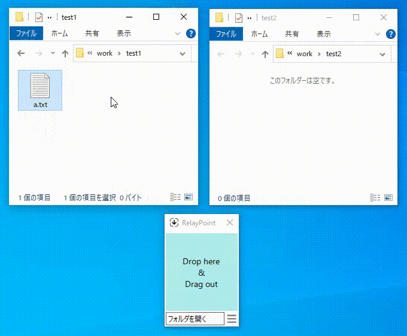
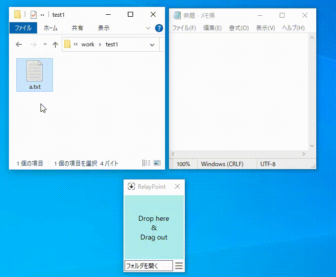
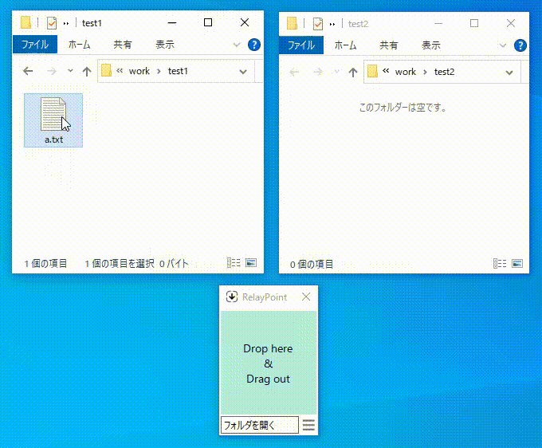
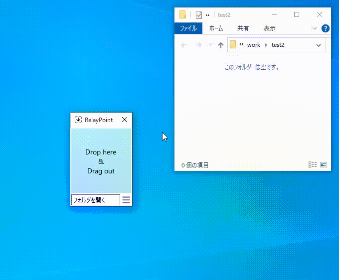
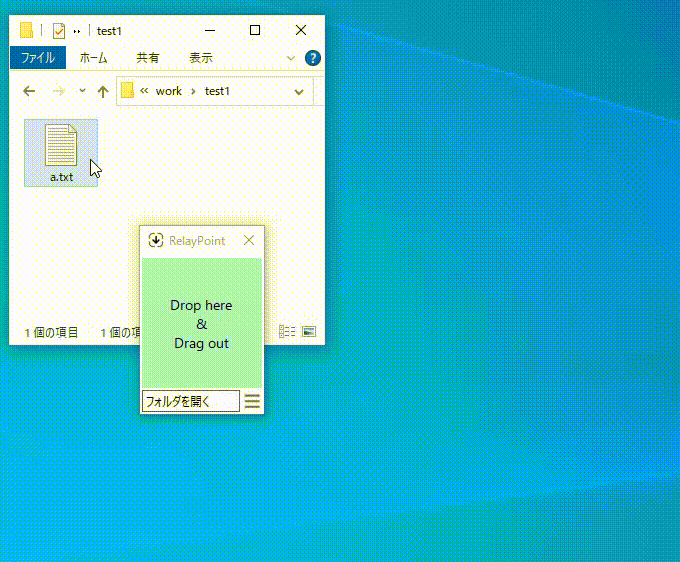

# RelayPoint

## 概要

* ファイルやフォルダを別の場所へ移動やコピーするときの中継点として機能します。  
* ファイルやフォルダがドロップされた状態でCtrl+Cを押すとドロップされたファイルやフォルダをクリップボードにコピーしたうえで自動で終了します。  

## 使用例

ファイルの移動・コピー  
  

アプリケーションへのドラッグ＆ドロップ  
  

エクスプローラと同じように右マウスでのドラッグ＆ドロップも可能  
  

フォルダの登録の仕方  
  

登録したフォルダの開き方  
  

## 動作確認環境
Microsoft Windows10 x64 + .NET Framework 4.8

## その他

* [DropPoint](https://github.com/GameGodS3/DropPoint)に感銘を受けて、自分でも作れないかと思い作成してみました。  
* リモートデスクトップなど、ファイルのコピーに際し、クリップボードを経由する必要がある場合に利用することができるようにCtrl+Cでクリップボードにコピーするようにしました。
* コピーするより移動することが多かったので移動もできるように、また移動先も登録できるようにしました。